# Voice Agent Setup with OpenAI Agents SDK

This document provides a quickstart guide to setting up voice agents using the OpenAI Agents SDK, based on the [official documentation](https://openai.github.io/openai-agents-python/voice/quickstart/).

## Prerequisites

- Ensure you have followed the base quickstart instructions for the Agents SDK and set up a virtual environment.
- Install the optional voice dependencies:
  ```bash
  pip install 'openai-agents[voice]'
  ```

## Key Concepts: VoicePipeline

The core component for voice agents is the `VoicePipeline`, which orchestrates a three-step process:

1. **Speech-to-text (STT):** Transcribes audio input into text.
2. **Agentic Workflow:** Executes your agent's logic using the transcribed text.
3. **Text-to-speech (TTS):** Converts the agent's text response back into audio output.

```mermaid
graph LR
    %% Input
    A["🎤 Audio Input"]

    %% Voice Pipeline
    subgraph Voice_Pipeline [Voice Pipeline]
        direction TB
        B["Transcribe (speech-to-text)"]
        C["Your Code"]:::highlight
        D["Text-to-speech"]
        B --> C --> D
    end

    %% Output
    E["🎧 Audio Output"]

    %% Flow
    A --> Voice_Pipeline
    Voice_Pipeline --> E

    %% Custom styling
    classDef highlight fill:#ffcc66,stroke:#333,stroke-width:1px,font-weight:700;
```



## Setting up Agents

You can create agents similar to how you would for text-based interactions.  The example provided sets up two agents:

- **`spanish_agent`**:  An agent that speaks Spanish.
- **`agent` (Assistant)**: A primary agent that can handoff to the `spanish_agent` if the user speaks Spanish. It also uses a `get_weather` tool.

```python
import asyncio
import random

from agents import (
    Agent,
    function_tool,
)
from agents.extensions.handoff_prompt import prompt_with_handoff_instructions


@function_tool
def get_weather(city: str) -> str:
    """Get the weather for a given city."""
    print(f"[debug] get_weather called with city: {city}")
    choices = ["sunny", "cloudy", "rainy", "snowy"]
    return f"The weather in {city} is {random.choice(choices)}."


spanish_agent = Agent(
    name="Spanish",
    handoff_description="A spanish speaking agent.",
    instructions=prompt_with_handoff_instructions(
        "You're speaking to a human, so be polite and concise. Speak in Spanish.",
    ),
    model="gpt-4o-mini",
)

agent = Agent(
    name="Assistant",
    instructions=prompt_with_handoff_instructions(
        "You're speaking to a human, so be polite and concise. If the user speaks in Spanish, handoff to the spanish agent.",
    ),
    model="gpt-4o-mini",
    handoffs=[spanish_agent],
    tools=[get_weather],
)
```

## Creating a Voice Pipeline

Instantiate a `VoicePipeline` with a `SingleAgentVoiceWorkflow`, passing your agent as an argument.

```python
from agents.voice import SingleAgentVoiceWorkflow, VoicePipeline

pipeline = VoicePipeline(workflow=SingleAgentVoiceWorkflow(agent))
```

## Running the Pipeline and Handling Audio

To run the pipeline, you need audio input. The quickstart example uses placeholder silence audio for simplicity. In a real application, you would capture audio from a microphone.

The output of `pipeline.run()` is an asynchronous stream of events. To play the audio response, you can use a library like `sounddevice` to stream audio events to your speakers.

```python
import numpy as np
import sounddevice as sd

# ... (pipeline setup from above) ...

# Placeholder audio input (silence)
audio = np.zeros(24000 * 3, dtype=np.int16)
result = await pipeline.run(audio)

# Audio player setup
player = sd.OutputStream(samplerate=24000, channels=1, dtype=np.int16)
player.start()

# Stream and play audio events
async for event in result.stream():
    if event.type == "voice_stream_event_audio":
        player.write(event.data)
```

## Putting it All Together (Example `main` function)

The documentation provides a complete example combining agent setup, pipeline creation, and audio handling within an `async main()` function.  Refer to the "[Put it all together](https://openai.github.io/openai-agents-python/voice/quickstart/#put-it-all-together)" section of the quickstart guide for the full code.

This quickstart provides a basic understanding of how to create voice agents using the OpenAI Agents SDK. For more advanced features and customization, explore the [full documentation](https://openai.github.io/openai-agents-python/voice/). 